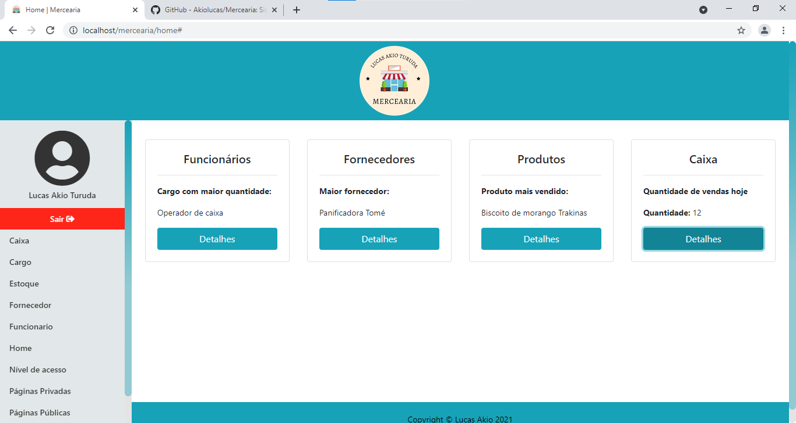
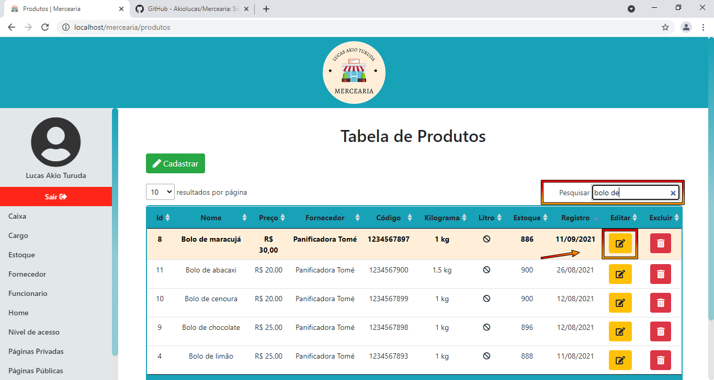
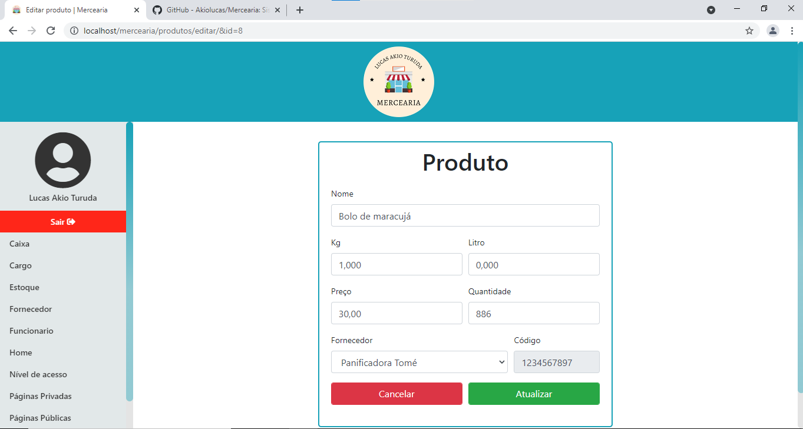

# Mercearia
<h2>Esse é um projeto desenvolvido com o intuito de apresentar um pouco dos meus conhecimentos com programação web.</h2>

<h3>Utilizando essa estrutura inicial desenvolvida por mim, você pode melhorá-la e aplicar no seu projeto pessoal, um E-commerce por exemplo.<h3>

 :warning: Atenção: Esse projeto está em desenvolvimento ainda.

:boom: Para funcionar corretamente você precisará:
 

<ul>
    <li>:file_folder: baixar todos os arquivos</li>
    <li>:exclamation: utilizar o composer para gerenciar as dependências veja como fazer: :point_down:
        <ul>
            <li>:one: instale o composer</li>
            <li>:two: abra o cmd ou outro prompt de comando</li>
            <li>:three: adicione a rota do seu projeto, de enter</li>
            <li>:four: você está dentro do diretório agora</li>
            <li>:five: de o segunte comando: :point_right: composer update e aguarde terminar tudo</li>
            <li>:six: se estiver tudo certo dentro do seu projeto será criado uma pasta :file_folder: vendor e um arquivo :pencil: composer.lock</li>
        </ul>
    </li>
    <li>:game_die: criar um banco de dados com a mesma estrutura que eu disponibilizei</li>
    <li>:gift: :heart_eyes: Pronto seguindo os passos acima, deverá estar tudo funcionando</li>
</ul>
  

Veja como está algumas páginas do projeto :camera::

<figure>
    
    <figcaption>:camera: Página login</figcaption>
</figure>

<figure>
    
    <figcaption>:camera: Página home</figcaption>
</figure>

<figure>
    
    <figcaption>:camera: Página inválida, observe que não existe no menu do usuário essa página</figcaption>
</figure>
 

<figure>
    
    <figcaption>:camera: Página produtos</figcaption>
</figure>
 

<figure>
    
    <figcaption>:camera: Página produtos, usando campo de pesquisa</figcaption>
</figure>
 

 <figure>
    
    <figcaption>:camera: Página produtos, clicando no botão de editar</figcaption>
</figure>
 

 <figure>
    
    <figcaption>:camera: Página de editar produtos</figcaption>
</figure>
 

 <figure>
    
    <figcaption>:camera:ao clicar em cadastrar abre esse modal de cadastro de produto</figcaption>
</figure>
 

 <figure>
    
    <figcaption>:camera:Imagem da página de fornecedores com CRUD também</figcaption>
</figure>
 

