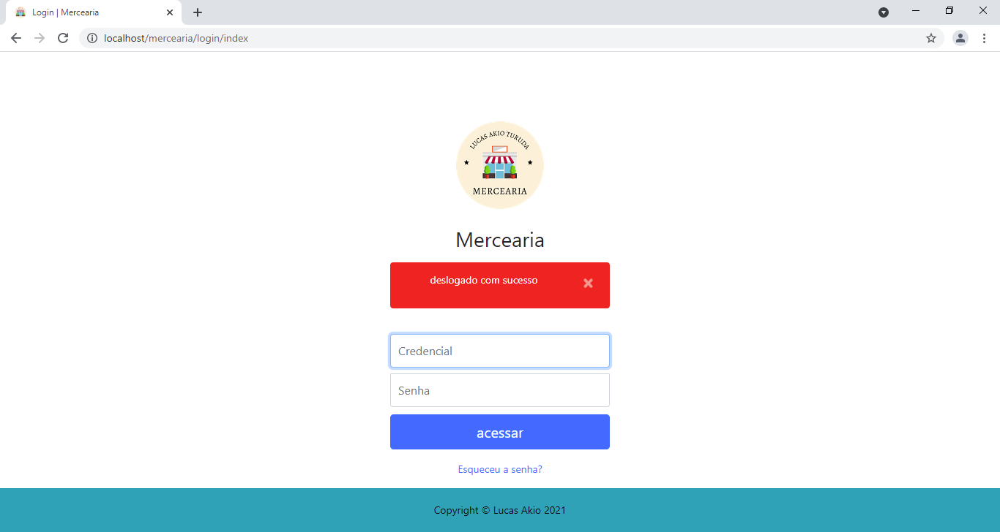
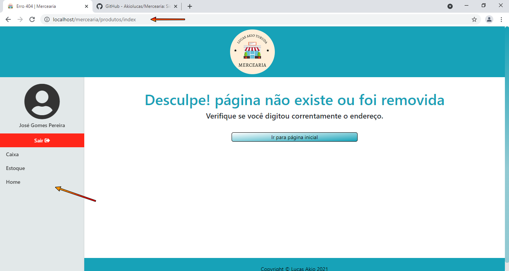

# Mercearia
<h2>Esse é um projeto desenvolvido com o intuito de apresentar um pouco dos meus conhecimentos com programação web.</h2>

 
<h3>Utilizando essa estrutura inicial desenvolvida por mim, você pode melhorá-la e aplicar no seu projeto pessoal, um E-commerce por exemplo.<h3>
 

<u><i><strong>Atenção:</strong></i></u> Esse projeto está em desenvolvimento ainda.

 

Para funcionar corretamente você precisará:

<ul>
    <li>manter todos os arquivos</li>
    <li>utilizar o composer para gerenciar as dependências veja:
        <ul>
            <li>instale o composer</li>
            <li>abra o cmd ou outro prompt de comando</li>
            <li>adicione a rota do seu projeto, de enter</li>
            <li>você está dentro do diretório agora</li>
            <li>de o segunte comando: <u><i><strong>composer update</strong></i></u> e aguarde terminar tudo</li>
            <li>se estiver tudo certo dentro do seu projeto será criado uma pasta <u><i><strong>vendor</strong></i></u> e um arquivo
            <u><i><strong>composer.lock</strong></i></u></li>
        </ul>
    </li>
    <li>criar um banco de dados com a mesma estrura que eu disponibilizei</li>
    <li><u><i><strong>Pronto seguindo os passos acima, deverá estar tudo funcionando</strong></i></u></li>
</ul>

Veja como está algumas páginas do projeto:

<figure>
    
    <figcaption>Página login</figcaption>
</figure>

<figure>
    
    <figcaption>Página home</figcaption>
</figure>

<figure>
    
    <figcaption>Página inválida</figcaption>
</figure>

